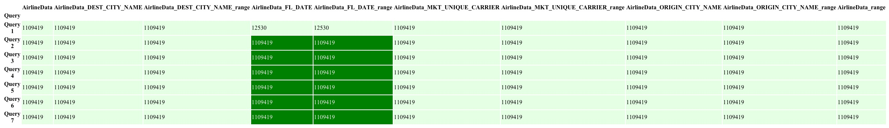
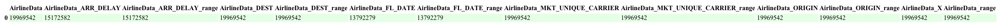

# Query Cost

The query costs here are the number of documents examined to produce result. From .explain("ExecutionStats") the number of documents examined are by shards. The number of documents in the table are, the shards added together. 

# Total costs

Total number of documents examined by each partition for executing the query workload.

[Back to Overview](index.md)
